# Jansen Workflows — Product Requirements (v0.8)

## 1. Purpose

Jansen Workflows is a browser-based approval workflow application for designing forms, defining multi-step approval flows, submitting requests, and tracking decisions. All data persists in the browser (`localStorage`); there is no backend.

## 2. Goals

| ID | Goal |
|----|------|
| G1 | Let admins design forms and exclusive approval workflows visually |
| G2 | Let users submit requests and advance them through role-based steps |
| G3 | Provide a clear register and audit history for every request |
| G4 | Support temporary approval delegation without removing existing permissions |
| G5 | Demonstrate multi-company / multi-role scenarios via an identity switcher |
| G6 | Support optional file attachments on forms (stored locally) |
| G7 | Keep list/detail/notification access consistent with who may approve |
| G8 | Let admins design reusable notification templates per form |
| G9 | Hand off in-progress approvals cleanly when a delegation starts and ends |
| G10 | Let admins configure production integrations (Azure AD, Azure SQL, email) in the UI |

## 3. Users & access

### 3.1 Roles (system)

| Role | Capabilities |
|------|----------------|
| **Requestor** | Submit forms; act on steps assigned to Requestor |
| **Manager** | Act on Manager decision/step nodes |
| **Project Director** | Act on Project Director nodes |
| **Admin** | Full access: users, roles, forms, notifications, workflows, Integrations, Data Tools, all approvals |

Custom roles may be app-scoped or form-scoped. Roles can map to Azure AD / AD group names for future SSO.

### 3.2 Identity

- App boots as **System Admin** (`admin@jansen.local`).
- Top-right **Acting as** switcher selects any local user (demo / testing).
- No real authentication in this version.

### 3.3 Companies & projects

- Companies: BHP, Hatch, Bantrel, Fluor.
- Projects: JS1, JS2, Operations.

### 3.4 Navigation

| Audience | Items |
|----------|--------|
| Everyone | Dashboard, Requests, Request Register, Delegations |
| Admin only | Forms, **Notifications**, Workflows, Users, Roles, **Integrations**, Data Tools (under Administration, in that order) |
| App bar | Notification bell (inbox), identity switcher, version badge (`v0.8`) |

Inbox (bell → `/notifications`) is separate from Administration → Notifications (template design at `/notification-templates`).

Dashboard hero tagline: **Project workflow management system.**

## 4. Functional requirements

### 4.1 Forms & workflows (1:1)

| ID | Requirement |
|----|-------------|
| FW-1 | **Each form must have exactly one dedicated workflow.** |
| FW-2 | Two forms must never share the same workflow. |
| FW-3 | Creating a form auto-creates a dedicated workflow when none is supplied. |
| FW-4 | Form builder only lists the form’s current workflow plus unassigned workflows. |
| FW-5 | Saving a form without a workflow is rejected (or a new dedicated workflow is created). |
| FW-6 | Deleting a form cascade-deletes its dedicated workflow and its submissions. |
| FW-7 | Deleting a workflow that is linked to a form replaces it with a new dedicated workflow for that form. |
| FW-8 | On load, shared or missing links are repaired to restore 1:1 pairing. |
| FW-9 | Workflow editor may link/unlink a form; linking moves the form from any previous workflow. |

### 4.2 Form builder

| ID | Requirement |
|----|-------------|
| FB-1 | Admins can create forms with fields: text, textarea, number, select, date, **file**. |
| FB-2 | Fields support label, required, placeholder/help text, and select options. |
| FB-3 | Live preview mirrors the submit experience. |
| FB-4 | Field order can be changed. |
| FB-5 | File fields store a single attachment as a data URL in localStorage (max **512 KB**). |
| FB-6 | Registers, PDF, notifications, and detail views show the **filename** (not raw base64). |
| FB-7 | The Change Request sample form includes an optional **Attachment** file field by default. |

### 4.3 Workflow editor

| ID | Requirement |
|----|-------------|
| WE-1 | Admins edit workflows on a visual canvas (React Flow). |
| WE-2 | Node types: start, step, decision, notification, end. |
| WE-3 | Steps/decisions assign a role; optional field-edit permission on the step. |
| WE-4 | Decision routing: manual outcomes and/or form-field conditions. |
| WE-5 | Related form enables field-based conditions and form-scoped roles. |
| WE-6 | Notification nodes pick a **form-dedicated notification template** (subject/body) and configure **recipients** (roles and/or notify submitter) on the node. |
| WE-7 | Templates from other forms cannot be selected on a workflow (no cross-form templates). |

### 4.4 Requests & register

| ID | Requirement |
|----|-------------|
| RQ-1 | Users open **Requests** to pick a form and submit; submission starts on the linked workflow. |
| RQ-2 | Request detail shows form data (including downloadable attachments), current step, and history. |
| RQ-3 | Eligible actors can approve / reject / complete steps with comments. |
| RQ-4 | History records actor, action, outcome, timestamp; delegate actions are labeled. |
| RQ-5 | Overall request register lists submissions with: request #, form name, submitter, submission date, last change date, status, current step. |
| RQ-6 | Each form has its own register showing form fields; users can customize column visibility and order (saved per identity). |
| RQ-7 | Registers support **field-aware** filtering from column headers: date columns use a between/relative date popup; status, form, current step, and select fields use **multi-select** dropdowns; other columns use partial text search. |
| RQ-7a | Users can clear an individual filter and clear all active filters. |
| RQ-8 | Dashboard shows pending items the current identity can both see and act on. |
| RQ-9 | Form design (`/forms`) is admin-only; non-admins are redirected to Requests. |
| RQ-10 | **Workflow History** shows only user actions: submission **step** and **decision** rows (not Notify / End / other system nodes). Columns: Step, User, Action / Outcome, Timestamp, Status (no Type). |
| RQ-11 | PDF history likewise includes only step and decision entries. |

### 4.5 Delegations

| ID | Requirement |
|----|-------------|
| DG-1 | A user may delegate approval authority for a date range (duration in days). |
| DG-2 | Coverage: **all workflows** (one delegate) or **per workflow** (possibly different people). |
| DG-3 | Delegate receives the **union** of their roles and the delegator’s roles for covered workflows (additive only). |
| DG-4 | Non-admins may only create/edit/delete **their own** outbound delegations. |
| DG-5 | Admins may create/manage delegations for any user. |
| DG-6 | Per-workflow UI lists workflows the delegator can act on, each with a user dropdown. |
| DG-7 | On create, the UI reports how many **in-progress actionable** requests the covered scope includes and asks whether to **notify the delegate** of those items. |
| DG-8 | When that option is on and the delegation becomes active, the delegate receives inbox notifications for those open requests. If more than four are open, one summary notification lists a link for each; otherwise one notification per request. |
| DG-9 | When a delegation **ends** (expires or is removed early), the **delegator** is notified of covered requests that are still in progress so they can continue them (same summary rule as DG-8 when more than four). |
| DG-10 | Start handoff respects a future start date (sends once the window is active); end handoff is skipped if the delegation never started. |
| DG-11 | A user cannot have overlapping outbound delegations for the same coverage: date ranges and workflow scope must not both overlap (an “all workflows” grant conflicts with any other grant in the same dates). |

### 4.6 Integrations

| ID | Requirement |
|----|-------------|
| IN-1 | Admins configure production integrations under **Administration → Integrations** (`/integrations`). |
| IN-2 | **Azure Active Directory**: enable flag; tenant ID; client ID; client secret; redirect URI; authority host; OAuth scopes; optional allowed email domain; SSO and directory-sync toggles; group claim name (for role AD group mapping). |
| IN-3 | **Azure SQL Database**: enable flag; server; port; database; auth method (`sql` / `azureAd` / `managedIdentity`); username/password when applicable; encrypt / trust-server-certificate; connection timeout; optional connection-string override; read-only connection-string preview. |
| IN-4 | **Email server**: enable flag; provider `smtp` or `microsoftGraph`; SMTP host/port/encryption/credentials **or** Graph tenant/client/secret/sender mailbox; from address / display name / reply-to. |
| IN-5 | Each section saves independently into `AppData.integrations` (localStorage). Settings survive Data Tools “reset everything”. |
| IN-6 | UI makes clear that values are configuration for a future production back-end (not live connections in the browser-only build). |

### 4.7 Data Tools

| ID | Requirement |
|----|-------------|
| AD-1 | Data Tools can seed sample users and/or requests independently via **Include users** / **Include requests (workflows)** checkboxes, each with **Create additional** or **Clear & recreate** modes and counts. |
| AD-2 | Optional checkbox to seed matching in-app notifications with requests. |
| AD-3 | Reset requests for a single form. |
| AD-4 | Reset all application data to defaults. |
| AD-5 | Data Tools is the last item under Administration; `/admin` redirects to `/data-tools`. |
| AD-6 | User-only seed runs must not overwrite existing forms/workflows; request seed applies the sample form/workflow catalog. |
| AD-7 | Sample requests use **random submitters/managers**, mixed statuses, **open items dated within the last week**, and older completed/rejected ages; form field dates align with submission age. |

### 4.8 Notification templates & in-app messages

| ID | Requirement |
|----|-------------|
| EN-1 | Admins design **notification templates** under Administration → Notifications (rich-text body via TipTap). |
| EN-2 | Each template is dedicated to exactly one form (form assignment required). |
| EN-3 | Templates define name, description, subject, and HTML body with `{{Field Label}}` / builtin tokens (`formName`, `requestId`, `status`, `submitter`). |
| EN-4 | Workflows support a **notification** step type that selects a template for the linked form. |
| EN-5 | Recipients (roles and/or the request submitter) are configured on the **workflow Notify node**, not on the template. |
| EN-6 | Form-scoped roles only apply on their linked forms when resolving recipients. |
| EN-7 | Notifications are created automatically when the workflow reaches the step. |
| EN-8 | Messages are **in-app only** (not emailed); open from the AppBar bell or the inbox Notifications page. |
| EN-9 | Sample manager-approval workflows ship with submit / approve / reject templates and matching Notify nodes. |
| EN-10 | Notification deep-links to a request are only offered when the viewer can open that request. |
| EN-11 | Deleting a form cascade-deletes its templates; deleting a template clears Notify-node references. |

### 4.9 PDF export

| ID | Requirement |
|----|-------------|
| PD-1 | Request detail provides a Print icon that downloads a PDF of the current form values and history. |
| PD-2 | PDF includes a branded top banner (app theme / orange gradient) with form title and request id. |
| PD-3 | Form fields render as labeled cards (form-like layout), not a plain text dump. |
| PD-4 | File field values appear as filenames in the PDF. |
| PD-5 | Notification / End history rows are omitted from the PDF (user actions only). |

### 4.9 Submission visibility

| ID | Requirement |
|----|-------------|
| SV-1 | Each form has a visibility boundary: own submissions, within company, or within project. |
| SV-2 | Admins always see all submissions. |
| SV-3 | Users who can act on a request always see it (and may approve/deny); action controls are never shown without act permission. |
| SV-4 | Users who previously acted on a request, or received an in-app notification for it, may open that request. |
| SV-5 | Registers, dashboard awaiting-action, and notification deep-links only surface requests the viewer can see. |

## 5. Non-functional requirements

| ID | Requirement |
|----|-------------|
| NF-1 | Frontend-only; persistence via `localStorage` key `jansen-workflows-data`. |
| NF-2 | Runs with Vite on port **5173** (dev) / **4173** (preview). |
| NF-3 | Responsive enough for desktop and tablet admin use. |
| NF-4 | No secrets or external API keys required. |
| NF-5 | Display version `APP_VERSION` (`0.8`) in AppBar and sidebar. |

## 6. Out of scope (current version)

- Live Azure AD SSO / token exchange (Integrations stores configuration only)
- Live Azure SQL or email delivery (configuration UI only in this browser build)
- Multi-user realtime sync
- Multiple files per field or attachments larger than 512 KB
- Mobile-first native apps

## 7. What’s new in v0.8

- **Administration → Integrations** — configure Azure AD (SSO/identity), Azure SQL, and email (SMTP or Microsoft Graph) for production readiness
- Workflow History: remove Type column; rename Actor → **User**
- Delegation handoffs: when more than four covered requests are open, one summary notification with per-request links (start and end)
- Block overlapping outbound delegations for the same user when dates and workflow coverage both conflict

## 7a. What’s new in v0.7

- Dashboard tagline: **Project workflow management system.**
- Register filters: date popover (between / relative last N days), multi-select dropdowns (status, form, current step, select fields), aligned text search, clear-all / clear-one
- Delegation handoff: optional notify delegate of in-progress items at start; notify delegator of unfinished items when the delegation ends

## 7b. What’s new in v0.6

- **Administration → Notifications** — form-dedicated rich-text templates (subject/body + field tokens)
- Workflow Notify nodes pick a template **and** configure recipients (roles / submitter)
- Admin nav order: Forms → Notifications → Workflows → …
- Request PDF: branded orange banner and form-like field cards
- TipTap rich-text editor for template bodies

## 7c. What’s new in v0.5

- Data Tools **Include users** / **Include requests** checkboxes
- Randomized sample submitters, timestamps (open ≤ 1 week; completed older)
- Workflow History hides Notify steps; reject branch only when used
- Tightened view vs approve access across dashboard, registers, notifications

## 8. Sample screenshots

Captured from the running app (also under `docs/screenshots/`). See **[USER_GUIDE.md](./USER_GUIDE.md)** for a full walkthrough.

### Dashboard
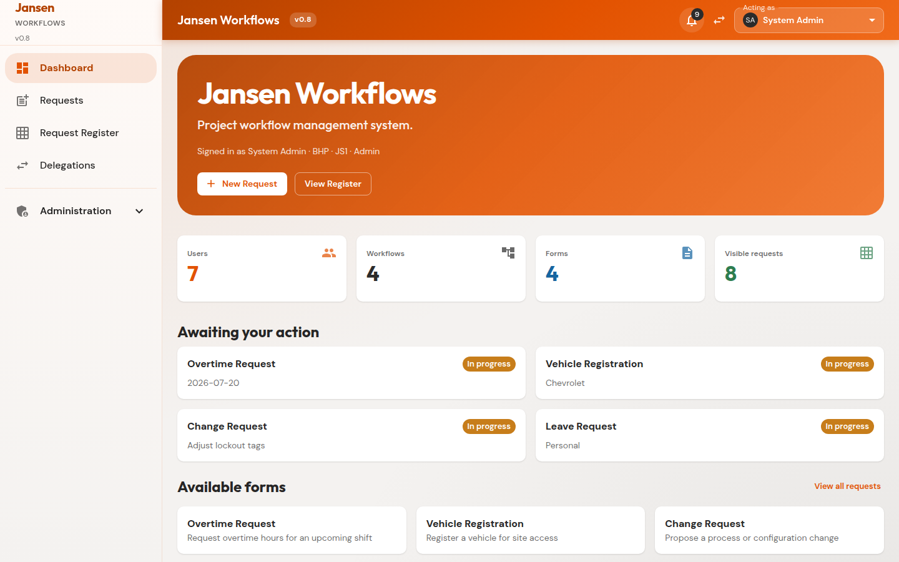

### Requests
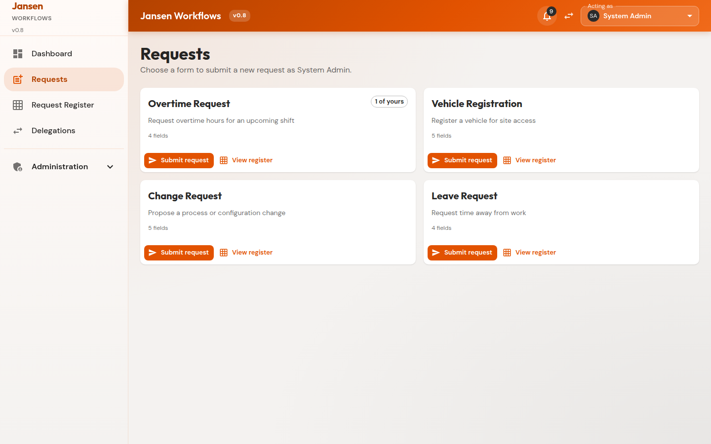

### Forms
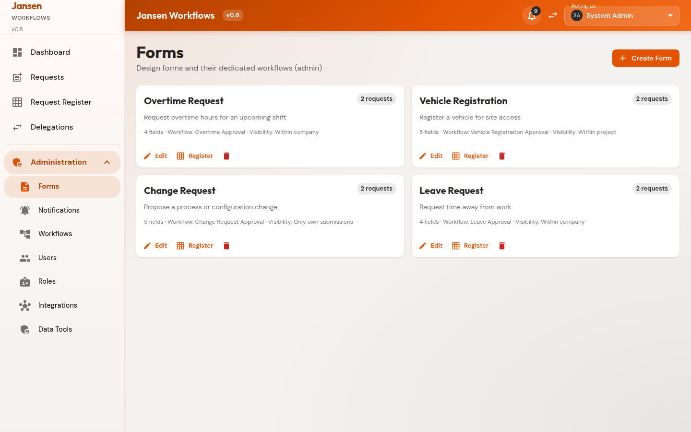

### Form builder (includes file field type)
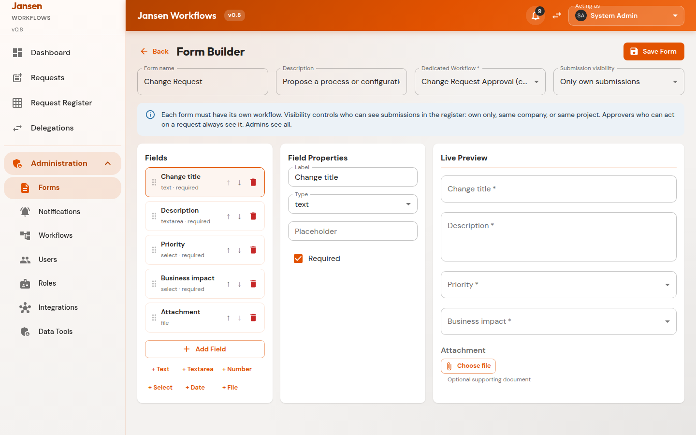

### Workflows
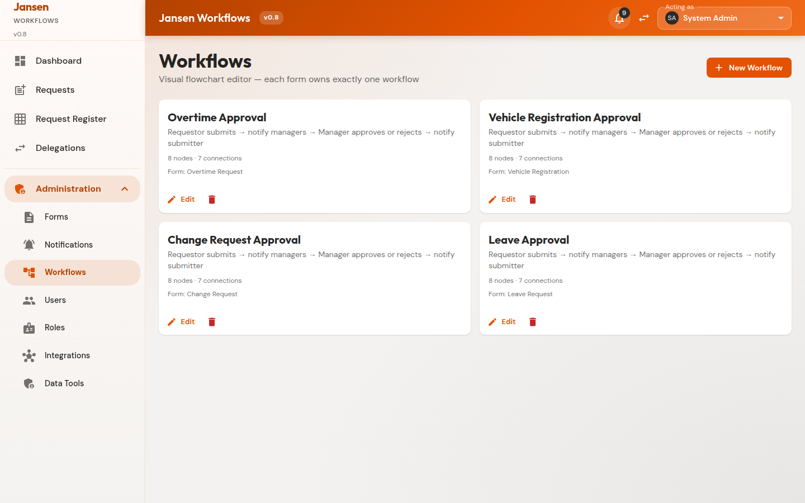

### Workflow editor
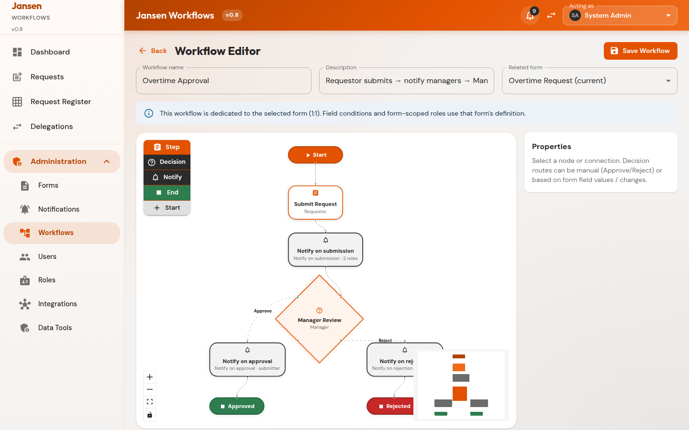

### Request register
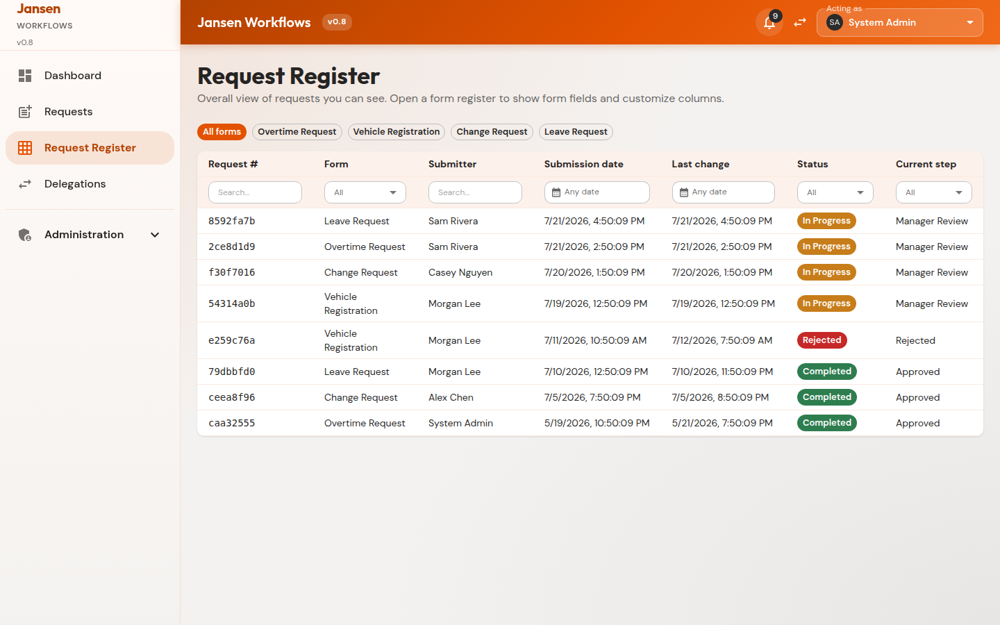

### Request detail
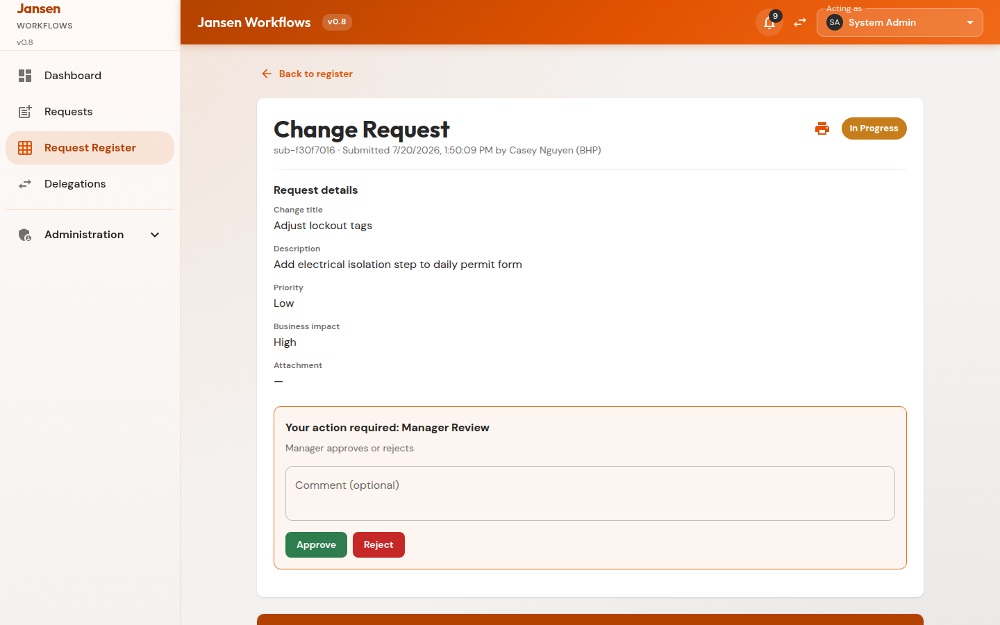

### Delegations
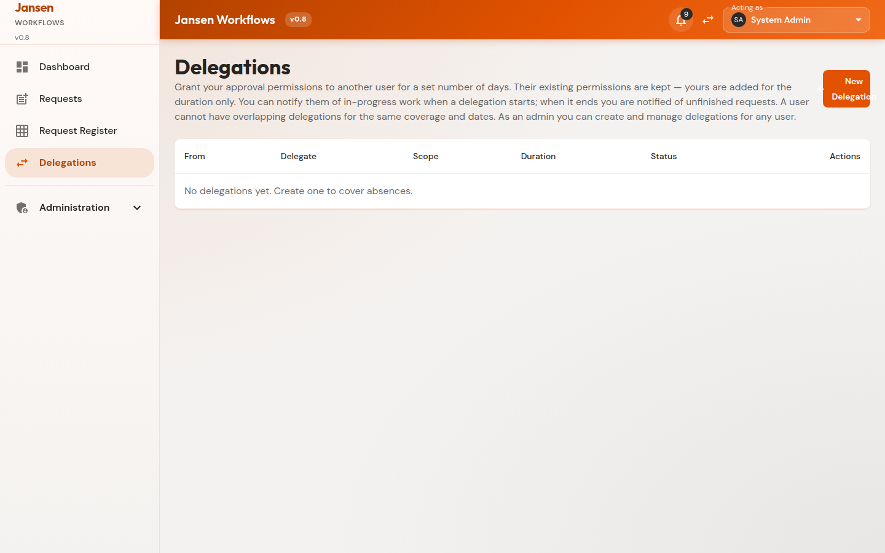

### Data Tools
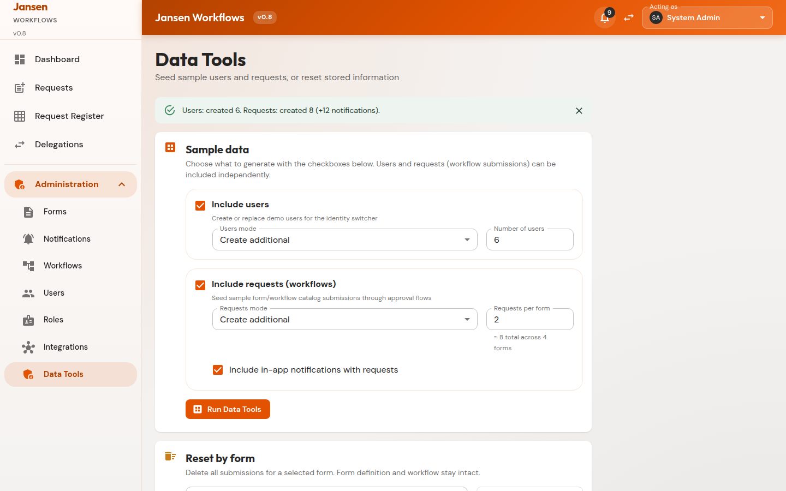

### Notification templates
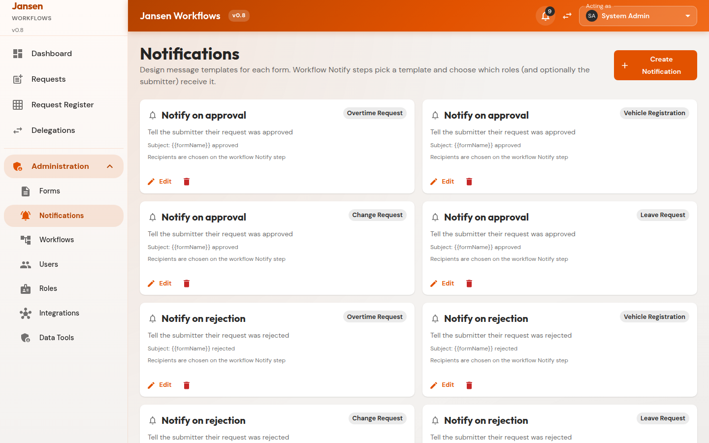

### Notification template editor
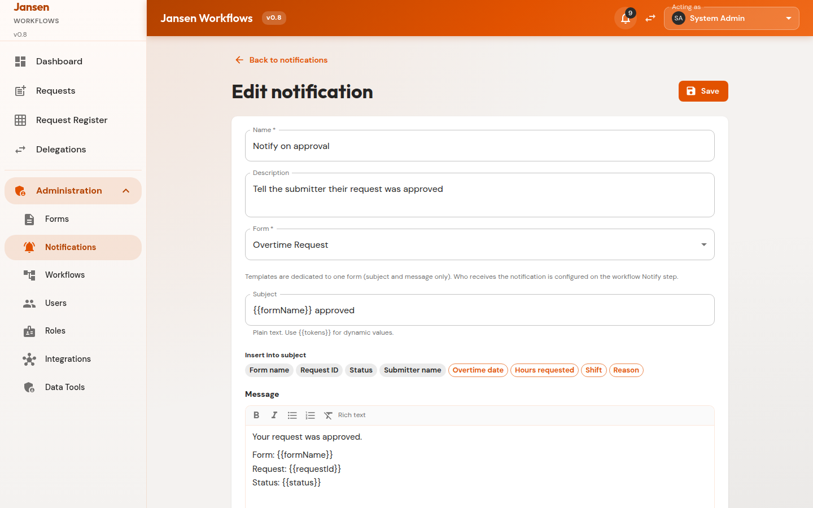

### Integrations
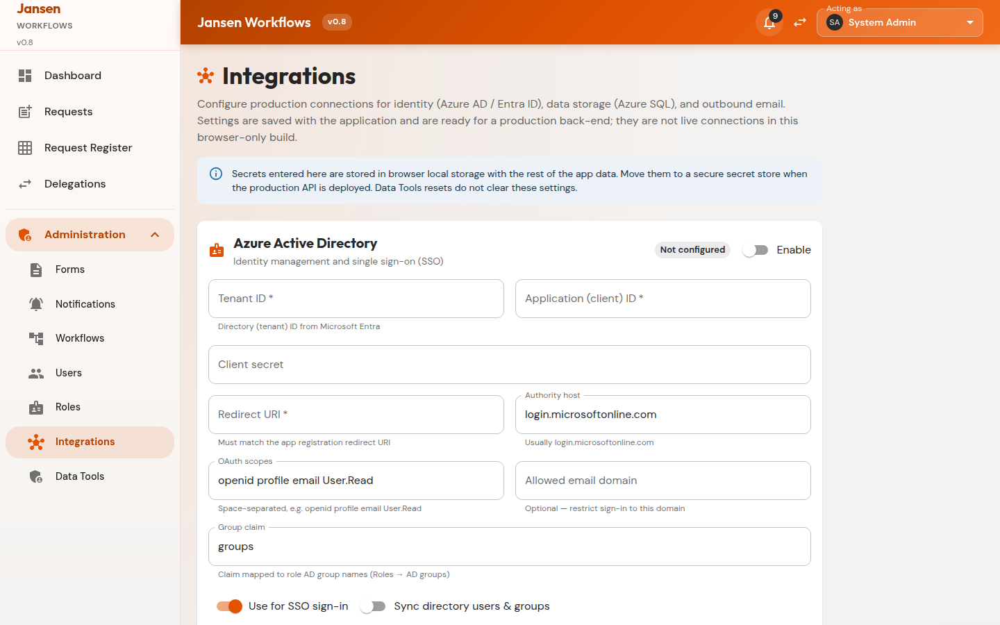

Regenerate with:

```bash
npm run dev   # in one terminal
npm run screenshots
```

## 9. Related documents

| Doc | Purpose |
|-----|---------|
| [USER_GUIDE.md](./USER_GUIDE.md) | End-user / admin how-to with screenshots |
| [RECREATE_PROMPT.md](./RECREATE_PROMPT.md) | Prompt to recreate this application from scratch |
| [AGENTS.md](../AGENTS.md) | Cursor Cloud agent notes |

## 10. Acceptance criteria (1:1 form–workflow)

1. Create Form twice → two forms and two distinct workflows.
2. Form builder cannot select another form’s workflow.
3. After reload, no two forms share `workflowId`.
4. Delete form removes its workflow; other forms unchanged.
5. Delete a linked workflow leaves the form with a newly created dedicated workflow.

## 11. Acceptance criteria (v0.8)

1. Version badge shows `v0.8`; dashboard hero reads “Project workflow management system.”
2. Administration → Integrations saves Azure AD, Azure SQL, and email settings independently; Data Tools reset preserves them.
3. Workflow History shows Step / User / Action / Timestamp / Status (no Type column).
4. Delegation start/end with more than four open covered requests produces one summary inbox message with links; overlapping same-user grants are blocked.
5. Prior v0.7 criteria still hold (register filters, basic delegation handoff, notification templates, PDF branding).
