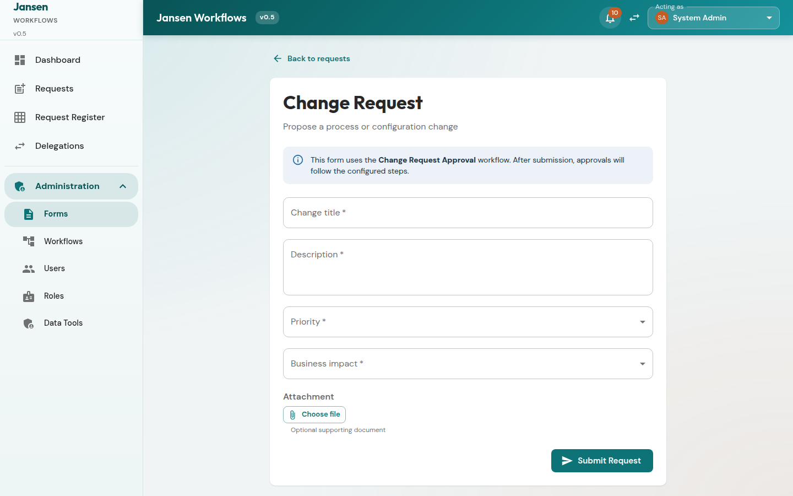
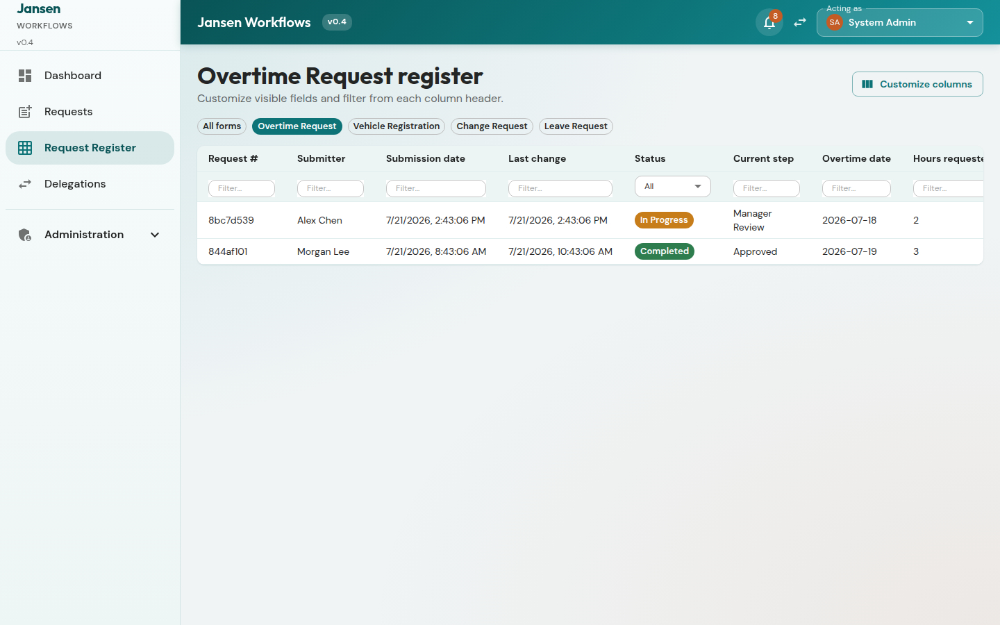
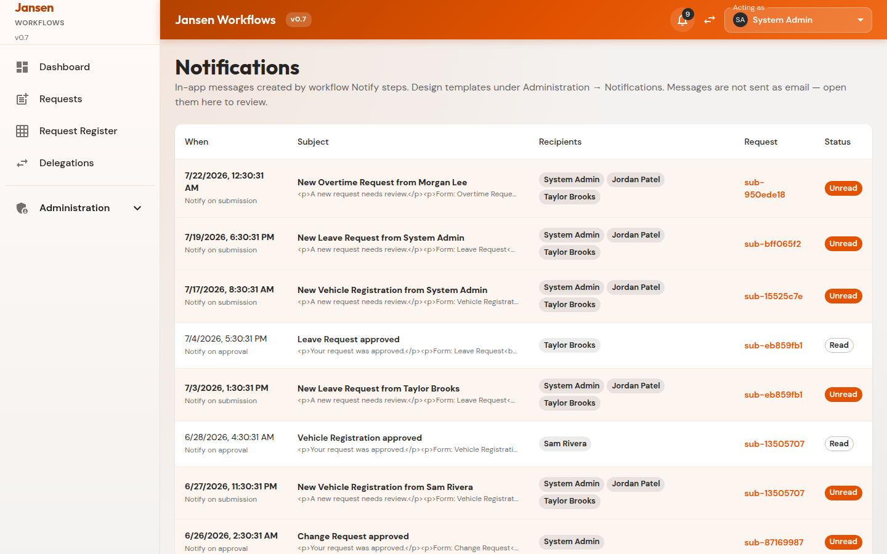
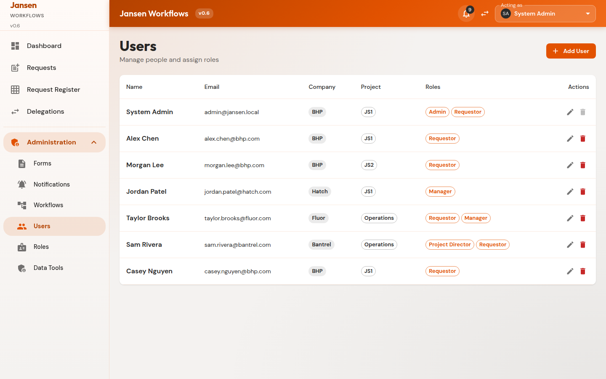
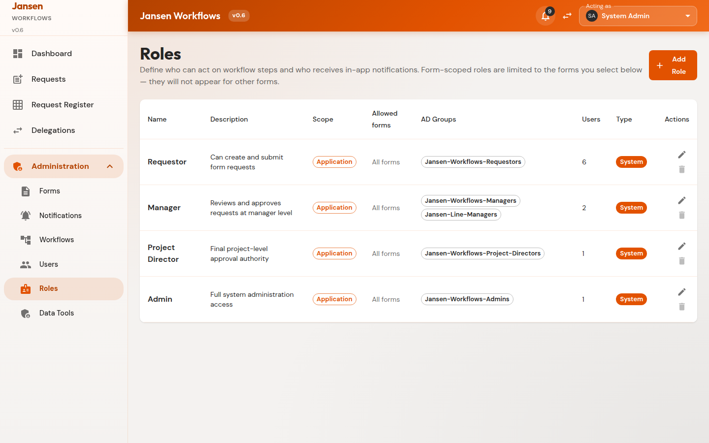

# Jansen Workflows — User Guide (v0.5)

This guide walks through day-to-day use of the local demo app. All data stays in your browser; use **Data Tools** to seed or reset sample content.

```bash
npm install
npm run dev
```

Open the URL shown (typically `http://localhost:5173`). You start as **System Admin**.

---

## 1. Orientation


| Control | Purpose |
|---------|---------|
| **Sidebar** | Dashboard, Requests, Request Register, Delegations; admins also see Administration |
| **Bell** | In-app notifications |
| **Acting as** | Switch identity (no password) |
| **v0.5** | App version |

The dashboard lists work waiting for the current identity — only requests you can both **see** and **act on**.

---

## 2. Submit a request

1. Open **Requests**.
2. Choose a form (e.g. Change Request).
3. Fill required fields. On Change Request you may attach an optional file (max 512 KB).
4. Submit — the workflow starts and notifications may fire.




---

## 3. Track requests in registers

**Request Register** shows every submission you are allowed to see (visibility + role/action rules):


Use column header filters to narrow results. Open a row for detail.

Each form also has a **per-form register** (from Forms → Register or `/register/form/...`) with that form’s fields. Customize visible columns and order; the layout is saved for your identity.



---

## 4. Review and approve

On **Request detail** you see field values (download attachments by filename), history, and — **only if you can act** — Approve / Reject / Complete with an optional comment.


**Workflow History** lists only what people did — submission steps and decisions (e.g. Submit Request, Manager Review). System Notify and End nodes are not shown.

Use the **print** icon to download a PDF snapshot (notification rows omitted there too).

### Who can see a request?

You can open a request if you are the submitter or an admin, you can act on the current step, you already acted on it, you received a notification about it, or you match the form’s company/project visibility.

---

## 5. Notifications

When a workflow reaches a Notify step, messages appear for the configured roles and/or the submitter. Open the bell or **Notifications**.



Sample flows notify managers/admins on submit and the submitter on approve or reject. **Open related request** is shown only when you still have access to that submission.

---

## 6. Delegations

Grant someone else your approval authority for a date range — for all workflows or specific ones. Permissions are **additive** (they keep their own roles too). Non-admins manage only their own outbound delegations; admins can manage any.


---

## 7. Administration (admins)

### Forms

Design field lists, visibility (own / company / project), and the linked workflow. Field types: text, textarea, number, select, date, **file**.


### Workflows

Edit the canvas: Start, Step, Decision, Notification, End. Assign roles, outcomes, and field conditions. Keep **one workflow per form**.


### Users & roles

Create users (company + project) and assign roles. Roles may be app-wide or limited to selected forms.





### Data Tools

Seed demo data with independent checkboxes:

1. **Include users** — mode (Create additional / Clear & recreate) + count  
2. **Include requests (workflows)** — mode + requests per form + optional notifications  

You can run either alone or both. User-only runs leave forms/workflows unchanged. Sample open requests are dated within the last week; completed ones may be older; submitters are randomized.

Also available: reset one form’s requests, or reset everything.


---

## 8. Tips

- Switch to a **Manager** identity after seeding to practice approvals.
- Attachments over 512 KB are blocked (browser storage limits).
- Clearing site data for this origin wipes the demo; use Data Tools → reset to restore defaults.
- Form design is admin-only; everyone uses **Requests** to submit.
- If you cannot see a request in the register, you also will not get approve/deny controls for it.

---

## 9. More detail

- Product requirements: [REQUIREMENTS.md](./REQUIREMENTS.md)
- Recreate-from-scratch prompt: [RECREATE_PROMPT.md](./RECREATE_PROMPT.md)
